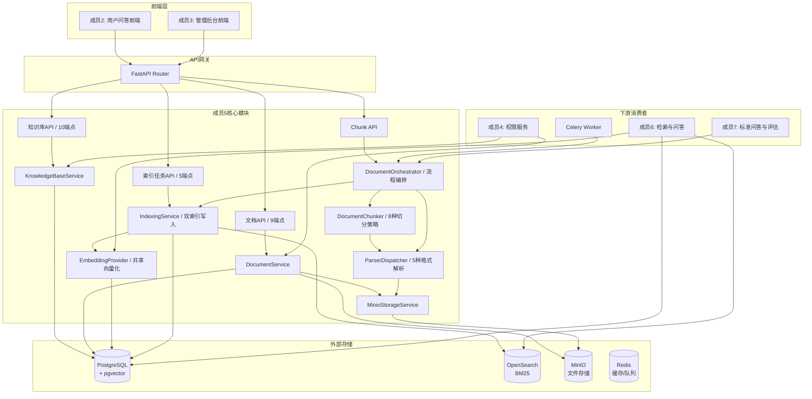
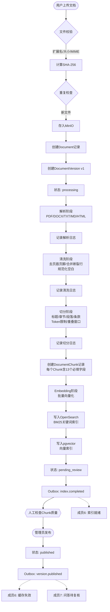
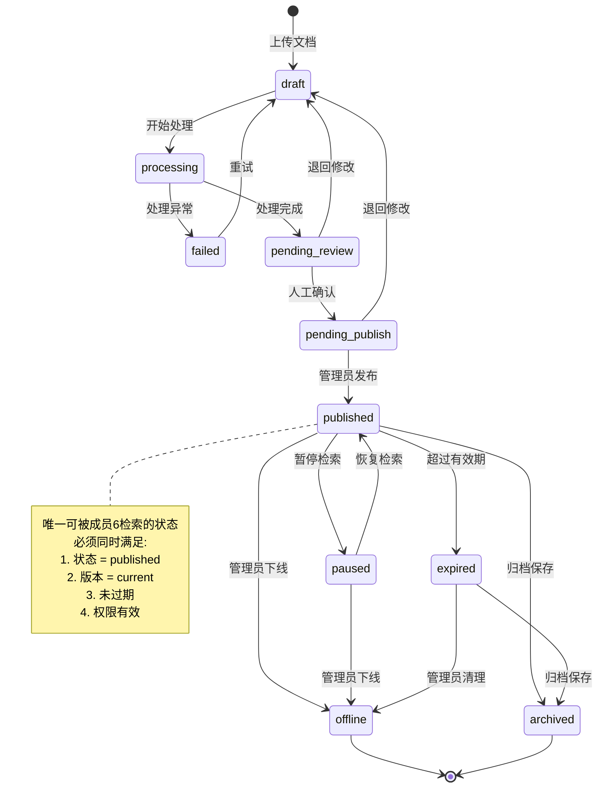
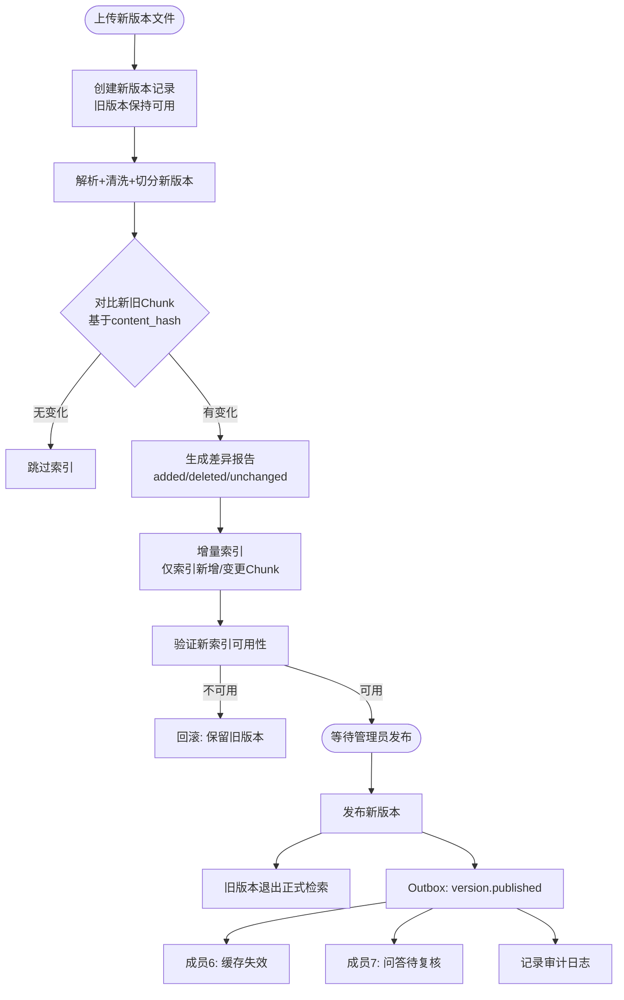
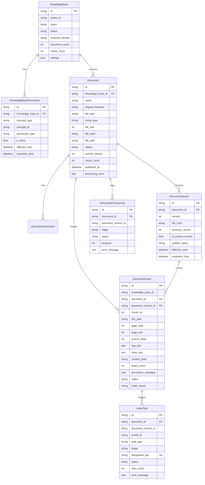
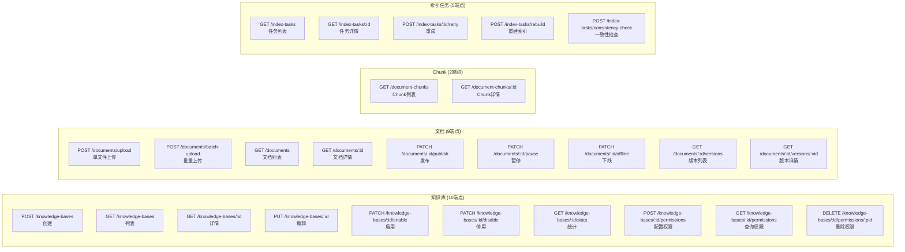
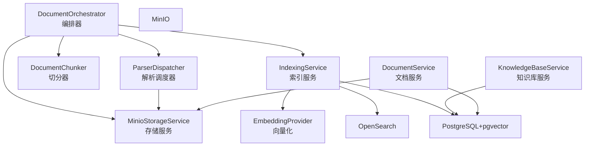

# 成员5 架构与流程图

---

## 1. 系统总体架构（成员5视角）



---

## 2. 文档处理完整流水线



---

## 3. 文档状态机



---

## 4. 版本更新流程



---

## 5. 数据模型 ER 图



---

## 6. API 端点全景图



---

## 7. 服务依赖关系



---

## 8. 项目文件结构（成员5产出）

```text
backend/app/
├── api/
│   ├── knowledge_bases.py    知识库CRUD+启停+统计+权限 (10端点)
│   ├── documents.py           文档上传+管理+发布+版本 (9端点)
│   ├── chunks.py              Chunk查询 (2端点)
│   ├── index_tasks.py         索引任务管理 (5端点)
│   └── ...
├── models/
│   └── document.py            数据模型 (8模型)
│       KnowledgeBase / KnowledgeBasePermission
│       Document / DocumentPermission
│       DocumentVersion / DocumentChunk
│       IndexTask / DocumentProcessLog
├── schemas/
│   └── document.py            请求响应Schema (25+个)
├── services/
│   ├── knowledge_base.py      知识库业务服务
│   ├── document.py            文档业务服务
│   ├── storage.py             MinIO存储服务
│   ├── chunking.py            文档切分服务 (8种策略)
│   ├── indexing.py            索引写入服务 (OS+pgvector)
│   ├── orchestrator.py        文档处理编排器
│   └── parsing/
│       ├── base.py            解析器基类+结果类型
│       ├── pdf_parser.py      PDF解析+OCR接口
│       ├── docx_parser.py     DOCX解析
│       ├── txt_parser.py      TXT解析
│       ├── md_parser.py       Markdown解析
│       ├── html_parser.py     HTML解析
│       └── dispatcher.py      调度器+清洗规则
├── providers/
│   └── embedding.py           共享EmbeddingProvider
├── tasks/
│   └── document.py            Celery异步任务 (4个)
└── core/
    └── celery_app.py          Celery应用工厂

backend/tests/unit/
├── test_document_models.py            模型测试 (52个)
├── test_knowledge_base_service.py     知识库服务测试 (15个)
├── test_document_service.py           文档服务测试 (20个)
├── test_storage.py                    存储服务测试 (39个)
├── test_parsing.py                    解析服务测试 (35个)
├── test_chunking.py                   切分服务测试 (19个)
├── test_embedding.py                  Embedding测试 (10个)
├── test_indexing.py                   索引服务测试 (8个)
└── test_orchestrator.py              编排器测试 (12个)
```
